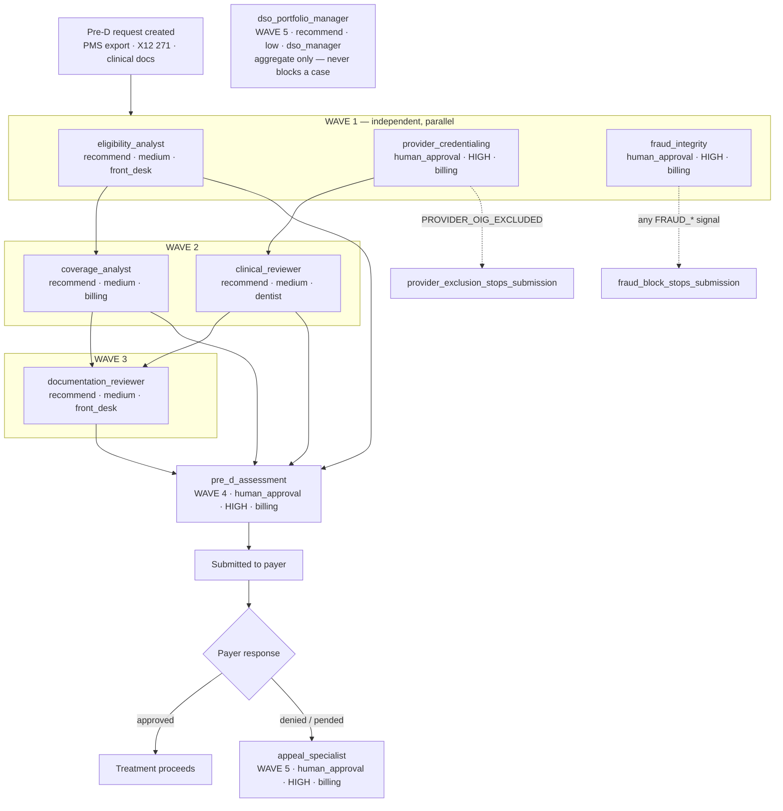

# DENTAL OS — PRODUCT REQUIREMENTS DOCUMENT

**Version:** 0.1 &nbsp;·&nbsp; **Updated:** August 2026 &nbsp;·&nbsp; Source of truth for Claude Code every session.

> **Repo:** `dental-os` — the product. &nbsp;·&nbsp; **Upstream:** `dental-simulator` — the rules engine and reference dataset.
> **Design partner:** Suwanee Smiles, Suwanee GA. &nbsp;·&nbsp; **First tenant:** `suwanee_smiles`.

---

## HOW TO USE THIS FILE

This file is the single source of truth for `dental-os`.
At the start of every session, read this file + `domains/dental/decisions.yaml`
+ `../dental-simulator/context.md`. Do not ask what the project is.
Do not ask what was built last. Read these files and know.

`decisions.yaml` is normative. Where this PRD and `decisions.yaml` disagree
about a boundary, a mode, or a wave, **`decisions.yaml` wins** and this
document is the thing that is out of date.

---

## 1. THE PROBLEM WE ARE SOLVING

### 1.1 One case, told properly

Dr. Chinta places an implant on tooth #19. The site needs bone before the
implant will hold, so the plan is three codes on one date:

```
  D6010   Implant body — endosteal        $2,400
  D7953   Bone graft — ridge preservation   $950
  D6065   Implant crown (PFM)             $1,450
                                          ──────
                                          $4,800   Delta Dental PPO
```

The front desk submits the pre-D. Fourteen days later Delta Dental answers:

> **D7953 — DENIED. Not separately payable.**

Not "we need more documentation." Not "send the X-ray." Just *not separately
payable* — a bundling rule the practice never saw, applied to a $950 line item
that was clinically necessary and correctly performed.

This is not an unlucky case. **It happens every time.** Delta Dental bundles
D7953 into D6010 by default; roughly **45%** of bone grafts are denied on first
pass for exactly this reason. And the denial is *overturnable* — with a PA X-ray
showing bone loss ≥3mm at the graft site and a clinical narrative establishing
the graft's necessity **independent of** the implant, the appeal succeeds about
**65%** of the time.

The problem is what it costs to find that out.

### 1.2 The two timelines

```
  WITHOUT ACCORD DENTAL
    Day  0   Treatment planned. Pre-D submitted as-is.
    Day 14   Denial arrives. "Not separately payable." Vague code.
    Day 14   Front desk does not know why, or what would fix it.
    Day 15+  3–5 hours to assemble an appeal by hand — if anyone does.
             ~60% of practices never appeal. The $950 is written off.

  WITH ACCORD DENTAL
    Day  0   Treatment planned.
    Day  0   Bundling conflict caught BEFORE submission.
             "Submit as-is and D7953 will be denied.
              Add these 2 items first: PA X-ray showing bone loss
              ≥3mm at the graft site, and a narrative establishing
              graft necessity independent of implant placement."
    Day  0   Both items are already in the chart. Attached.
    Day  8   Approved on first pass.
```

The 14-day wait was never the expensive part. **Not knowing** was.

### 1.3 The root cause

Delta Dental's coverage rules are complex, undocumented at the point of care,
and change frequently. At the moment the pre-D is submitted, the front desk has
no visibility into:

- which CDT codes trigger bundling conflicts on this plan
- what bone loss measurement is required to support a bone graft
- which frequency limits apply to this specific patient's history
- what documentation Delta Dental will require before approving

Everything needed to answer those four questions already exists — in the chart,
in the X12 271, in the payer's own published rules. Nobody has assembled it at
the moment it matters.

### 1.4 Who feels it most

| Who | The shape of the loss |
|---|---|
| **Independent practices doing complex work in-house** (Suwanee Smiles) | Invested in CBCT, implant placement, grafting and perio to avoid referring out — and lose 15–20% of that high-value revenue to denials they could overturn |
| **DSO central billing across 10–100+ locations** | The same denial pattern hits every location at once, with no systematic way to spot it, fix the documentation template, and stop it network-wide |

---

## 2. PRODUCT VISION

> # Dental Decision Intelligence
> ### Evidence assembled. Policy applied. Decisions explained.

`dental-os` is **the explanation layer on top of `dental-simulator`.**

That sentence is the entire architecture, and it constrains everything:

```
  The POLICY ENGINE decided.      dental-simulator applied the coverage
                                  rules, scored the ADA criteria, computed
                                  pred_states. That already happened.

  The AI EXPLAINS.                dental-os reads what the engine decided
                                  and says why, in language the front desk
                                  can act on, with a citation behind it.

  DR. CHINTA DECIDES.             Every decision in this system is
                                  `recommend` or `human_approval`.
                                  There is no auto_execute. Ever.
```

**What Accord Dental IS**
- The intelligence layer between the chart and the payer
- The tool that catches denials *before* they happen
- The system that makes every pre-D defensible to a payer medical director

**What Accord Dental is NOT**
- Not a clearinghouse or claim submission tool (Availity, Change Healthcare)
- Not a billing system (Dentrix, Eaglesoft, Open Dental)
- Not an EHR replacement
- **Not an autonomous decision-maker.** See §7.

---

## 3. DESIGN PARTNER

**Suwanee Smiles**
3155 Peachtree Pkwy Ste 120, Suwanee, GA 30024
Dr. Sridhar Chinta, DMD & Dr. Sonya Shyam, DMD — husband and wife, co-owners
https://suwaneedentalimplants.com/

| | |
|---|---|
| First tenant id | `suwanee_smiles` |
| Dr. Chinta NPI | **1134534266** (verified against NPPES) |
| Reference payer | Delta Dental of Georgia (PPO) |
| Reference scenario | **DA-A01** — D6010 + D7953 + D6065, tooth #19, ~$4,800 |

**Why them:** full in-house scope — implant placement *and* restoration, bone
grafting, periodontics, endodontics, same-day CAD/CAM crowns, 3D CBCT, iTero and
Medit scanners. Exactly the procedures where pre-D denials are most frequent and
most painful. Dr. Chinta is a neighbour in Alpharetta/Suwanee — walk-in access
for design feedback, real cases, real denials.

> The earlier NPI **1467573653** is not a registered NPI. Do not reintroduce it.

---

## 4. ARCHITECTURE

### 4.1 Two repos, one product

```
┌───────────────────────────────────┐      ┌───────────────────────────────────┐
│  dental-simulator                 │      │  dental-os                        │
│  THE RULES ENGINE                 │      │  THE EXPLANATION LAYER            │
│                                   │      │                                   │
│  29 Postgres tables               │      │  9 decisions across 5 waves       │
│  35 validated scenarios           │─────▶│  8 personas + pre-D synthesis     │
│  108 real PDFs in S3              │ READ │  Boundary engine (recommend /     │
│  Coverage + bundling + frequency  │ ONLY │    escalate / block — no auto)    │
│  ADA criteria scoring             │      │  Decision trace per case          │
│  pred_states — the decision       │      │  Appeal packet generation         │
│                                   │      │                                   │
│  DECIDES                          │      │  EXPLAINS                         │
└───────────────────────────────────┘      └───────────────────────────────────┘
                                                          │
                                                          ▼
                                              ┌───────────────────────┐
                                              │  accorddental.com     │
                                              │  NOT STARTED          │
                                              └───────────────────────┘
```

`dental-simulator` stays as the reference dataset and rules engine. `dental-os`
consumes it: the assemblers in `domains/dental/`, the rule hierarchy, and the
35-scenario catalogue as its test corpus.

### 4.2 The three-layer rule hierarchy

Declared in `domains/dental/decisions.yaml` under `rule_hierarchy`. This is the
dental counterpart to lending's regulatory → agency → overlay chain.

```
┌────┬──────────────────┬──────────────┬──────────────────────────────────────────┐
│ 1  │ ADA GUIDELINES   │ clinical     │ The clinical floor. A payer rule or a    │
│    │                  │ authority    │ tenant overlay may be STRICTER, never    │
│    │                  │              │ looser. CANNOT BE OVERRIDDEN.            │
├────┼──────────────────┼──────────────┼──────────────────────────────────────────┤
│ 2  │ PAYER COVERAGE   │ contractual  │ Delta Dental / Cigna / MetLife / United  │
│    │ RULES            │              │ Concordia. Coverage, bundling, frequency │
│    │                  │              │ and downgrade. From coverage_rules +     │
│    │                  │              │ bundling_rules.                          │
├────┼──────────────────┼──────────────┼──────────────────────────────────────────┤
│ 3  │ TENANT OVERLAY   │ practice     │ Suwanee Smiles exceptions.               │
│    │                  │              │ ALWAYS WINS over payer rules.            │
│    │                  │              │ From overlay_rules.                      │
└────┴──────────────────┴──────────────┴──────────────────────────────────────────┘
```

Read it as: **overlay beats payer, payer beats nothing clinical.** ADA sets a
floor that neither of the other two layers may drop below. Every threshold a
decision applies is stamped with the layer it came from and its citation —
that is what makes a pre-D defensible to a payer medical director.

### 4.3 Where the decisions sit



---

## 5. THE 9 DECISIONS

> **On the count.** `dental-simulator` PRD §14 defines **8 AI personas**.
> `decisions.yaml` defines **9 decisions** — those 8 plus `pre_d_assessment`,
> the Wave 4 synthesis step that has no persona upstream. It is load-bearing:
> `appeal_specialist` depends on it, and it is the only point where a human
> signs off on the complete packet before submission. Where this repo says
> "8 decisions", read "8 simulator personas + the pre-D synthesis".

Full specification — boundaries, own_data, SLAs, contamination guards — lives in
[`domains/dental/decisions.yaml`](../domains/dental/decisions.yaml). That file is
normative; the table below is a reader's index into it.

| # | Decision | Wave | Mode | Risk | Owner | Key signal |
|---|---|---|---|---|---|---|
| 1 | `eligibility_analyst` | 1 | recommend | medium | front_desk | `ELIGIBILITY_VERIFIED` |
| 2 | `provider_credentialing` | 1 | human_approval | **HIGH** | billing | `PROVIDER_OIG_EXCLUDED` |
| 3 | `fraud_integrity` | 1 | human_approval | **HIGH** | billing | `INTEGRITY_VERIFIED` |
| 4 | `coverage_analyst` | 2 | recommend | medium | billing | `COVERAGE_BUNDLING_CONFLICT` |
| 5 | `clinical_reviewer` | 2 | recommend | medium | dentist | `CLINICAL_CRITERIA_MET` |
| 6 | `documentation_reviewer` | 3 | recommend | medium | front_desk | `DOCUMENTATION_COMPLETE` |
| 7 | `pre_d_assessment` | 4 | human_approval | **HIGH** | billing | `PRED_READY_TO_SUBMIT` |
| 8 | `appeal_specialist` | 5 | human_approval | **HIGH** | billing | `APPEAL_PACKET_READY` |
| 9 | `dso_portfolio_manager` | 5 | recommend | low | dso_manager | `PORTFOLIO_DENIAL_PATTERN` |

**Read the mode column again.** Five `recommend`, four `human_approval`,
**zero `auto_execute`**. There is no `automate_if` clause anywhere in
`decisions.yaml`. Boundary precedence is `BLOCK > ESCALATE > RECOMMEND` —
`recommend` is the highest outcome any dental decision can reach.

### 5.1 Wave semantics

Everything inside a wave runs in parallel; a wave starts only when the previous
wave has settled.

```
  WAVE 1   eligibility · provider · fraud        independent — no upstream context
  WAVE 2   coverage · clinical                   inherit Wave 1 dispositions
  WAVE 3   documentation                         inherit coverage + clinical
  WAVE 4   pre_d_assessment                      synthesises all of 1–3
  WAVE 5   appeal (on denied/pended) · portfolio (aggregate)
```

Every dependent decision carries a `contamination_guard`. An upstream block
propagates: `pre_d_assessment` fails closed if any upstream blocked, and no
amount of downstream reasoning can talk it out of that.

---

## 6. DATA SOURCES

### 6.1 What `dental-simulator` provides

Verified live 2026-08-05 — read from the database, not estimated.

| | |
|---|---|
| Postgres tables | **29** (17 reference · 5 transactional · 5 computed · 2 graph) |
| Rows | **1,414** |
| Scenarios | **35** — Groups A / B / C / D / M / F |
| Documents | **108** real PDFs in S3 under the `suwanee_smiles/` prefix |
| Extraction confidence | 0.92 avg — 97 deterministic, 10 caller_supplied, 1 ai_vision |
| Knowledge graph | 108 nodes, 24 typed edges (13 confirms · 10 contradicts · 1 corroborates) |
| Decisions | 20 pended · 8 approved · 7 denied |
| Financials | $128,505 billed → $29,221.52 insurance / $52,230.03 patient, 67 estimate lines |

**All four validators green:** `validate_pipeline.py` 35/35 · `validate_db.py`
35/35 · `validate_fk_integrity.py` 0 errors · `validate_alb.py` 35/35.

### 6.2 What `dental-os` reads

```
  8 CONTEXT VIEWS              one per persona, built in dental-os migrations
    vw_eligibility_context       vw_coverage_context
    vw_clinical_context          vw_documentation_context
    vw_provider_context          vw_integrity_context
    vw_appeal_context            vw_portfolio_context

  READ-ONLY connection to the dental-simulator RDS
    dental_app : dental_app_dev @ dental-postgres...rds.amazonaws.com/dental
    RLS enforced. dental-os never writes to simulator tables.
```

Personas read the views. Personas never read raw document tables, and never
call the rule loader directly — the context enricher is the catalogue gateway.

> **⚠ RLS is `FORCE` and `dental_app` is a non-owner.** Every query must
> `SET app.tenant_id = 'suwanee_smiles'`. A connection without it returns
> **0 rows — indistinguishable from an empty table.** This has already caused
> one false "wrote zero rows" report. Prove visibility before concluding data
> is missing.

---

## 7. AGENT BOUNDARIES

> # AI DECIDES NOTHING.

This is not a posture and it is not a phase. It is enforced in
`decisions.yaml`: no `auto_execute` mode exists in the dental domain, no
`automate_if` clause exists on any boundary, and `ai_never_auto_executes` is a
hard rule. A dental decision's ceiling is `recommend`.

The division of labour is the same everywhere: **the AI surfaces the
measurement against the threshold. The human makes the judgment.**

| Persona | What the AI does | What the human does |
|---|---|---|
| `eligibility_analyst` | Surfaces coverage_active, annual max remaining, waiting period status, missing tooth clause | Front desk confirms the plan on file is current and tells the patient what they owe |
| `provider_credentialing` | Surfaces NPPES verification, OIG LEIE hit, network status, specialty match | Billing decides whether to submit under this NPI at all |
| `fraud_integrity` | Surfaces the `cdt_codes_noted` mismatch — billed D2750, note says D2740 | **Billing manager decides if it is fraudulent** or a charting slip |
| `coverage_analyst` | Surfaces "D7953 is bundled with D6010 under Delta policy D.7.4; separable with documentation" | Billing decides whether to unbundle with docs or accept the bundle |
| `clinical_reviewer` | Surfaces `bone_loss_mm = 3.4` against the ≥3.0mm threshold, criteria_score 0.88 | **Dr. Chinta confirms clinical necessity.** The score is evidence, not a verdict |
| `documentation_reviewer` | Surfaces which required documents are missing, stale, or extracted below 0.70 confidence | Front desk chases the missing X-ray |
| `pre_d_assessment` | Assembles every upstream disposition into one readiness view with open conditions listed | **Billing coordinator signs off before anything is submitted** |
| `appeal_specialist` | Estimates 65% appeal viability, maps the denial code to a known appeal path, drafts the packet | **Billing + Dr. Chinta decide whether to appeal** |
| `dso_portfolio_manager` | Surfaces the denial pattern across locations and the revenue at risk | DSO manager decides where to retrain |

Two of those rows carry the weight of the whole section:

- `clinical_reviewer` computes a criteria score. **It does not diagnose.**
  A 0.88 means the documentation supports the procedure under ADA criteria —
  whether the patient needs the graft is Dr. Chinta's call, and always was.
- `fraud_integrity` finds mismatches. **It does not accuse.** A surface conflict
  between the note and the X-ray is far more often a charting error than fraud,
  and the system's job is to put both values side by side, not to label anyone.

---

## 8. PROVIDER WORKFLOW

Five steps, from the patient walking in to the patient understanding what they
owe. Every step names the decisions behind it.

### Step 1 — Check-in · eligibility in 3 seconds

Patient arrives. The X12 271 is already back. `eligibility_analyst`
(SLA **3s**) returns coverage active, annual max remaining, waiting period
status, and whether this plan excludes implants at all. In parallel,
`provider_credentialing` and `fraud_integrity` have already run.

> *"Active. $1,320 of the $1,500 annual max remaining. 12-month major-services
> waiting period satisfied as of March. Implants covered at 50%."*

### Step 2 — Treatment planning · the bundling conflict is caught

Dr. Chinta plans D6010 + D7953 + D6065 on tooth #19. `coverage_analyst` reads
the payer's bundling rules; `clinical_reviewer` scores the chart against ADA
criteria. Before anything is submitted:

> *"D7953 is bundled with D6010 under Delta Dental PPO policy D.7.4 — separable
> with documentation. Bone loss on the PA X-ray reads 3.4mm against a ≥3.0mm
> threshold. The clinical narrative does not yet establish graft necessity
> independent of implant placement. Add that and D7953 stands on its own."*

This is the step that pays for the product. **Day 0, not day 14.**

### Step 3 — Submission · all conditions resolved

`documentation_reviewer` confirms every required document is present, current,
and extracted above 0.70 confidence. `pre_d_assessment` synthesises all of
Waves 1–3 into one readiness view. The billing coordinator reads the open
conditions, sees none, and signs off. **A human signs. Always.**

### Step 4 — Payer response · appeal packet if denied

The X12 278 or portal response lands. If approved, the pred_number and valid
dates are recorded. If denied or pended, `appeal_specialist` maps the denial
reason code to a known appeal path, estimates viability, and generates the
packet — policy clause cited, ADA guideline cited, chart documentation
attached, bone loss measurement quoted. **< 2 minutes**, against 3–5 hours by
hand. Billing and Dr. Chinta decide whether to send it.

### Step 5 — Patient benefit summary · before treatment begins

The patient is told what the plan pays and what they owe, in writing, **before
the drill starts.** Not at checkout. Not in a statement six weeks later. The
cost estimate came from the same computed state the pre-D did, so it cannot
drift from what was submitted.

---

## 9. SUCCESS METRICS

### 9.1 Operational

| Metric | Manual baseline | Accord Dental target |
|---|---|---|
| Pre-D submission time | 30+ minutes | **< 5 minutes** |
| First-pass approval rate | ~55% (industry) | **> 75%** |
| Bundling conflicts caught before submission | ~0% | **100%** |
| Frequency violations caught before submission | ~0% | **100%** |
| Appeal generation time | 3–5 hours | **< 2 minutes** |
| Appeal overturn rate | ~40% (manual) | **> 60%** (documented) |
| Denial reason identification | Vague code | **Specific policy clause cited** |
| Patient cost surprise at checkout | Common | **Zero** — quoted before treatment |

### 9.2 Revenue impact — one practice

Assumptions: 30 implant cases/month · 45% bone graft denial rate · $950 average
bone graft · 60% write-off rate (never appealed) · 65% overturn when documented.

```
  CURRENT STATE
    30 cases × 45% denied           = 13.5 denials/month
    13.5 × 60% never appealed       =  8.1 written off
    8.1 × $950                      = $7,695/month written off

  WITH ACCORD DENTAL
    Bundling conflict caught pre-submission → documentation added
    First-pass approval 55% → 75%
    30 cases × 25% denied           =  7.5 denials/month
    7.5 × appeal auto-generated × 65% overturn
                                    = $4,631/month recovered

  NET                               ≈ $8,000/month, one practice
  DSO at 50 locations               ≈ $400,000/month
```

### 9.3 Technical

| Metric | Target |
|---|---|
| Eligibility response (Step 1) | < 3s — `eligibility_analyst.sla_seconds` |
| Pre-D synthesis (Step 3) | < 300s — `pre_d_assessment.sla_seconds` |
| Appeal packet generation | < 120s — `appeal_specialist.sla_seconds` |
| Decisions with a complete trace | **100%** — `trace_required: true` on all 9 |
| Decisions reaching `auto_execute` | **0** — structurally impossible |

---

## 10. BUILD STATUS

| Repo | Status | Detail |
|---|---|---|
| `dental-simulator` | ✅ **COMPLETE** | 29 tables · 1,414 rows · 35/35 validated on all four gates · 108 PDFs indexed · deployed on ECS Fargate behind a public ALB |
| `dental-os` | 🟡 **IN PROGRESS** | **Phase 0 — docs.** This PRD + `domains/dental/decisions.yaml` are the first two artifacts. No application code yet. |
| `accorddental.com` | ⬜ **NOT STARTED** | Domain not yet pointed at AWS account 740104998309 |

### Phase 0 — docs (current)

- [x] `domains/dental/decisions.yaml` — 9 decisions × 5 waves, source of truth
- [x] `docs/PRD.md` — this file
- [ ] `docs/ARCHITECTURE.md` — context views, enricher, persona contract
- [ ] `core/context/` — the 8 context views + migrations

---

## 11. KNOWN GAPS

Carried forward from `dental-simulator`, deliberately.

| # | Gap | Status |
|---|---|---|
| 1 | Readiness flags not wired | open |
| 2 | Group U scenarios not built | open |
| 3 | Appeal generation — table, no logic | open |
| 4 | `coverage_rules` breadth | **CLOSED** — 543 rows |
| 4a | Coverage *provenance* — 14 of 181 codes traced to a manual | open |
| 5 | Two `CONFIDENCE_FLOOR` constants | half-closed |
| 6 | `dental_scenarios.xlsx` churn | cosmetic |

### 1. Readiness flags not wired in `dental-simulator`

`pred_states.readiness_flags`, `status` and `decision_confidence` are **NULL for
all 35 scenarios**, by design. The 14 named checks are specified in
dental-simulator PRD §12 and the underlying signals are all computed and stored
— coverage_active, criteria_score, open_conditions, bundling conflicts — but
they are never rolled up into the 14 flags. `pre_d_assessment` is the natural
consumer; rolling them up is its first dependency.

### 2. Group U scenarios not built

Groups A/B/C/D/M/F ship 35 scenarios. **Group U** — urgency/emergency, 3
scenarios (DA-U01 emergency extraction + graft, DA-U02 acute perio abscess,
DA-U03 trauma/multiple teeth) — is specified in dental-simulator PRD §15 but not
in the manifest. Building it takes the catalogue to 38. Until then `dental-os`
has **no expedited-path test corpus**, and no scenario exercises an SLA under
pressure.

Related: there are no uncontested-approval scenarios beyond Group A's five. The
corpus is deliberately weighted toward conflict, which is right for rule
coverage and wrong for measuring false-positive rate.

### 3. Appeal generation has a table but no logic

UC-4 in dental-simulator PRD. The `appeals` table exists with `rationale`,
`policy_citation` and `overturn_reason` columns; nothing populates them.
`appeal_specialist` (Wave 5) is specified in `decisions.yaml` down to its
boundary and viability thresholds, but there is no generator behind it yet.
This is the single highest-value unbuilt thing in either repo — §9.1 claims
3–5 hours → <2 minutes and today that number is unearned.

### 4. ~~`coverage_rules` is only 14 rows~~ — **CLOSED**

Breadth is closed. **543 rows = 181 CDT codes × 3 payers** (Delta Dental PPO,
Cigna DPPO, MetLife PDP). Every CDT code resolves for every payer, and
`coverage_resolver` returns no SAFE_DEFAULT for any billed pair across the 35
scenarios.

| Tier | Codes | What it is |
|---|---|---|
| **1** — explicit payer rules | **14** (Delta only) | Read from the published provider manual: bundling, frequency, downgrade and policy section per code. `seed_delta_dental_rules.sql` |
| **2** — category defaults | **163** Delta, **177** each for Cigna/MetLife | `(category, subcategory)` → benefit class. Standard commercial structure, **not** read from each payer's manual |
| **3** — explicitly not covered | **4** | `D1310` + `D1330` counselling, `D0470` diagnostic casts, `D9230` nitrous |

**`fee_schedules`: 588 rows across 7 states** — 28 codes × 3 payers × 7 states
(GA, FL, TX, NC, SC, TN, AL).

`coverage_resolver` is what this breadth was for. It answers the question that
used to require a phone call to Delta Dental, per code:

```
  provider UCR fee  →  contracted rate  →  in-network discount
                    →  deductible  →  plan pays  →  patient owes
```

Validated against dental-simulator's own `cost_estimates`, which computes the
same claim independently: **32 of 35 scenarios agree on the patient total**, and
DA-A01 agrees line for line ($1,017.50 / $212.50 / $595.00, total $1,825.00).

### 4a. What closing #4 did NOT close

Breadth is not the same as provenance, and two things are worth stating plainly
before anyone quotes these numbers to a patient or a payer.

**Only 14 of the 181 codes trace to a published manual.** The other 167 carry
standard commercial class defaults — preventive 100%, basic 80%, major and
implant 50%. Those percentages are right for a typical PPO and wrong for any
plan that negotiated something else. `no_citation_without_source` is satisfied
in form (every rule has a catalogue row) and not in substance (a Tier 2 row
cites a convention, not a document). Closing this is
`refresh_payer_rules.py`'s job.

**`deductible_applies` is derived, not catalogued.** There is no such column;
`rule_loader` computes it as `benefit_category != 'preventive'`. That single
derivation is why DA-C07 disagrees with `cost_estimates` by $50.

Two other scenarios (DA-B05, DA-D03) also diverge, deliberately: when the
waiting period is not met the resolver pays **$0**, because the plan genuinely
pays nothing today, while `cost_estimates` prices the case as though approved.
For a pre-treatment quote the resolver's answer is the honest one.

And on the fee side — see the note under `refresh_fee_schedules.py` — **only
Georgia's 66 SPA-adjusted rows trace to a government document.** The other six
states are GA amounts times a judgement multiplier.

### 5. `dental-simulator` has TWO different `CONFIDENCE_FLOOR` constants

**Status: half-closed.** `dental-os` picked a side; `dental-simulator` still
disagrees with itself.

There is no single confidence floor in the simulator. There are two, and which
one applies depends on which layer of the pipeline is asking:

| Constant | Value | Files |
|---|---|---|
| **Extraction floor** — when to spend a Claude token | `0.6` | `core/documents/extractors/base.py:21`, imported by `xray_extractor.py`, `perio_extractor.py`, `clinical_note_extractor.py`, `pred_letter_extractor.py` |
| **Ingestion floor** — when a value is trustworthy enough to use | `0.70` | `core/ingestion/adapters/pdf_adapter.py:9`, `domains/dental/assemblers/clinical_assembler.py:10`, `scripts/build_scenarios_xlsx.py:118` |

> **If you opened `base.py` expecting `0.70` and found `0.6`, this is why.**
> Neither value is a typo and neither is wrong on its own — they answer
> different questions. `0.6` is "is this bad enough that Claude should look at
> it?" `0.70` is "is this good enough to base a decision on?" The bug is that
> nothing in either repo says so, so the two read as one constant that
> disagrees with itself.

**The consequence** is the band between them. A document scoring **0.65** is
*fine* to the extractor — good enough that the Claude fallback never fires — and
simultaneously *requires verification* to `pdf_adapter.py`, which stamps
`requires_verification=True` and `extraction_method=ai_vision` on a value no AI
ever touched. The same number, the same document, two verdicts.

**What `dental-os` did about it:** `documentation_reviewer` is written against
**0.70**, and `decisions.yaml` carries a comment block at that boundary naming
both constants and both file sets. 0.70 is the right side to land on here
because `clinical_assembler.py` is what gates evidence into `pred_states`, and
`pred_states` is the only thing this decision reads. So `dental-os` no longer
disagrees with the assembler.

**What is still open:** the split itself, which lives entirely in
`dental-simulator`. Fixing it is a small change and a naming decision, not a
refactor:

1. Rename to say what each one means — `AI_FALLBACK_FLOOR = 0.6` and
   `TRUST_FLOOR = 0.70` — so the two can never again be read as one value.
2. Or collapse to a single constant and accept the cost: raising the extraction
   floor to 0.70 sends more documents to Claude (every 0.6–0.7 document now
   costs a token); lowering the trust floor to 0.6 admits weaker extractions
   into `pred_states` and moves `documentation_reviewer`'s boundary with it.

Until one of those happens, **do not assume a `CONFIDENCE_FLOOR` you find in
`dental-simulator` is the one this PRD means.** Check which file it came from.

### 6. One smaller one worth carrying

- `scripts/dental_scenarios.xlsx` churns on every rebuild (openpyxl writes zip
  timestamps), so it always shows as modified. Ignore it; don't chase it.

---

## APPENDIX A — GLOSSARY FOR THE MORTGAGE-BRAINED

`dental-os` is the same engine as `edms-simulator` / `decision-os` with a
dental domain pack. If you know the lending side, this is the mapping.

| Lending | Dental | Note |
|---|---|---|
| Loan application | Pre-D request (`pred_requests`) | The root entity |
| `entity_states` | `pred_states` | The central computed table |
| `underwriting_decision` | `pre_d_assessment` | Wave 4 synthesis, human_approval, high risk |
| Credit bureau pull | X12 271 eligibility response | Wave 1 external verification |
| AUS findings (DU/LP) | Payer response (X12 278) | The authority's answer |
| Agency guidelines (Fannie/FHA) | ADA guidelines | Layer 1 — the floor |
| Lender overlay | Tenant overlay | Layer 3 — always wins |
| `automate_if` | **— does not exist —** | The whole point. See §7 |
| Adverse action notice | Appeal packet | Except this one argues back |

---

## APPENDIX B — FILES THAT ARE NORMATIVE

Read in this order. Later files defer to earlier ones on conflict.

```
  1. domains/dental/decisions.yaml     boundaries, modes, waves, signals
  2. ../dental-simulator/context.md    live state + the 15 CRITICAL RULES
  3. ../dental-simulator/docs/PRD.md   schema, coverage rules, ADA criteria,
                                       conditions library, 35 scenarios
  4. docs/PRD.md                       this file — product intent
```

The 15 CRITICAL RULES in `dental-simulator/context.md` apply to `dental-os`
unchanged. The three that will bite first:

1. **AWS account 740104998309 only** — never Capital Loans (621646470377).
   Every `aws` command takes `--profile dental`.
2. **Every query sets `app.tenant_id`.** RLS is FORCE; without it you get 0 rows
   and no error.
3. **No invented data.** Every row traceable to a source. Every citation
   traceable to a catalogue row.
